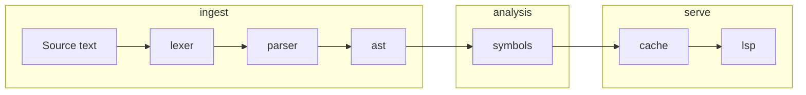
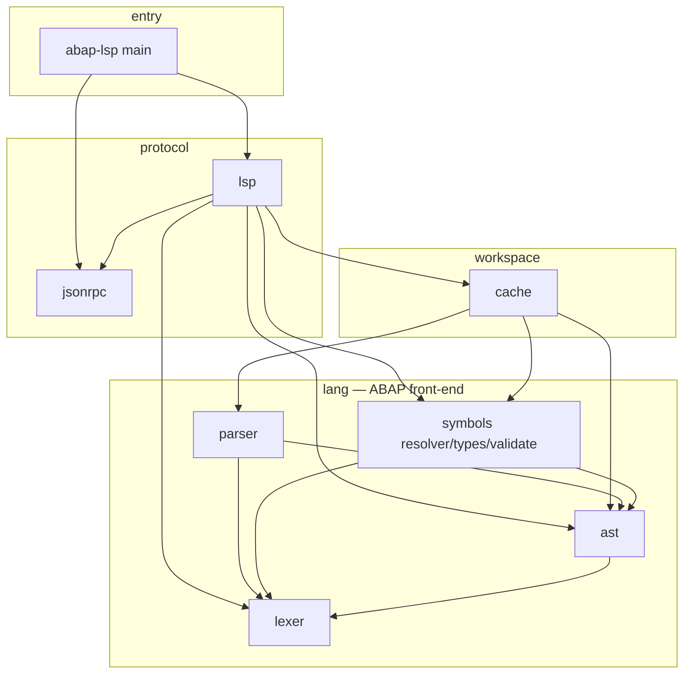

# ABAP Language Server (abap-lsp)

A [Language Server Protocol](https://microsoft.github.io/language-server-protocol/) implementation for **SAP ABAP**, written in [Odin](https://odin-lang.org/). It is aimed at fast, accurate feedback in the editor and at supporting modern workflows (navigation, diagnostics, completions, semantic highlighting) including **AI-assisted development**, where a structured understanding of the program beats plain text.

## Goals

- **Editor experience**: hovers, go-to-definition-style resolution where implemented, semantic tokens, completions, and diagnostics driven by real parsing and symbol tables—not only regex or text heuristics.
- **Throughput**: keep analysis incremental and cache-friendly so edits on large sources stay responsive.
- **Faithful ABAP modeling**: lexer → AST → symbol resolution mirror ABAP constructs so features stay aligned with the language rather than generic “C-like” assumptions.

## Architecture

Data generally flows **up** from source text through the language stack, then **sideways** into LSP handlers that read cached snapshots:



**Dependency direction** (who may import whom): lower layers do not depend on higher ones.



- **`jsonrpc`**: JSON-RPC framing and message types; no ABAP knowledge.
- **`lang/lexer`**: tokens, positions, and low-level text utilities used everywhere ranges are needed.
- **`lang/ast`**: syntax tree and node unions; depends only on the lexer package for ranges/tokens.
- **`lang/parser`**: builds `ast.File` from tokens; depends on **lexer + ast** only (not on `symbols`).
- **`lang/symbols`**: symbol tables, types, name resolution, validation; depends on **ast + lexer** (not on `parser`).
- **`cache`**: documents, workspaces, parsing and re-resolution orchestration; bridges **parser + symbols + ast**.
- **`lsp`**: LSP method handlers (hover, completion, diagnostics, semantic tokens, etc.) on top of **cache** and language results.

Editor integration assets (for example VS Code grammar or extension metadata) live under `editors/`.

## Repository layout

| Path | Role |
|------|------|
| `src/abap-lsp/` | Executable entry (transport + server startup). |
| `src/jsonrpc/` | JSON-RPC I/O and message structures. |
| `src/lsp/` | LSP features: requests/notifications, JSON types, positioning helpers. |
| `src/cache/` | Document and workspace cache, publish/refresh pipelines. |
| `src/lang/lexer/` | Tokenizer. |
| `src/lang/ast/` | AST definitions, lookups (`lookup.odin`), construction helpers (`utils.odin`). |
| `src/lang/parser/` | Parser (`parser.odin` and focused modules, e.g. Open SQL, OOP). |
| `src/lang/symbols/` | Symbols, types, resolver, semantic validation. |
| `tests/` | Package tests: `lexer`, `parser`, `symbols`, `cache`, `lsp`, etc. |

## Remote Dependency Resolution

When a workspace uses `abapls.toml` with `[resolution].dependency_mode = "remote-on-demand"`, the server can ask the editor integration to fetch missing remote dependencies via ADT. For local source trees, prefer `dependency_mode = "local-first"` so analysis stays workspace-only until you intentionally opt into remote fetches.

Useful manifest knobs:

```toml
[resolution]
dependency_mode = "local-first"
unknown_symbol_mode = "log"
remote_request_parallelism = 4
remote_requests_per_second = 8
```

- `dependency_mode = "local-first"` keeps dependency resolution local; `remote-on-demand` enables ADT-backed dependency fetching.
- `unknown_symbol_mode = "remote"` fetches dependencies automatically when `dependency_mode = "remote-on-demand"`; `log` records unresolved candidates to `.abapls/logs/unknown-symbols.log`.
- `remote_request_parallelism` bounds how many dependency fetch jobs may be in flight at once on the client side.
- `remote_requests_per_second` caps total ADT HTTP request throughput across those jobs.
- The language server deduplicates candidates by normalized symbol name before notifying the client, so the same symbol is not requested repeatedly under different kind hints.

## Building

On Windows, from the repo root:

```bat
.\build.bat abap-lsp
```

Debug is the default. For an optimized build:

```bat
.\build.bat release abap-lsp
```

Equivalent Odin invocations (after adjusting paths for your machine):

```text
odin build src\abap-lsp -debug -o:none -out:bin\debug\abap-lsp.exe
odin build src\abap-lsp -o:speed -out:bin\release\abap-lsp.exe
```

## Tests

```bat
.\test.bat
```

Underlying command:

```text
odin test tests/ -all-packages -debug -o:none -out:bin/debug/tests.exe
```

Run **build** and **tests** after non-trivial changes so compilation and behavior stay green.

## References

- [Odin language](https://odin-lang.org/docs/overview/)
- [Odin standard library](https://pkg.odin-lang.org/)
- [ABAP documentation](https://help.sap.com/doc/abapdocu_latest_index_htm/latest/en-US/ABENABAP.html)

## Extending the language model

Adding or changing an AST node touches several places (lookup, symbols, LSP). See `.cursor/rules/abap-lsp-project-rule.mdc` for a maintained checklist and naming conventions.
